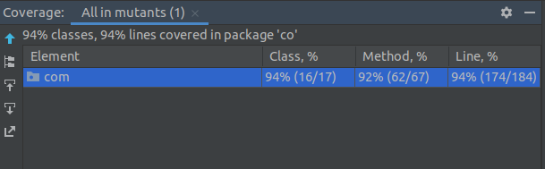

# Mutants API

Es una API REST que permite: 
- Analizar la secuencia ADN de una persona y determina si es un humano o un mutante. 
- Consultar las estadísticas de los análisis realizados.

## Contenido

- [Tecnologias](#tecnologias)
- [Configuracion](#configuracion)
  - [Pasos](#pasos)
- [API URLs](#api-urls)
- [Endpoins](#endpoints)
  - [MutantsController](#mutantscontroller)
  - [StatsController](#statscontroller)
- [Documentacion](#documentacion)
- [Monitorizacion](#monitorizacion)
- [Pruebas](#pruebas)
  - [Cobertura](#cobertura)

## Tecnologias
- [Java 8](https://docs.oracle.com/javase/8/docs/)
- [Spring Boot](https://spring.io/projects/spring-boot/)
- [Maven](https://maven.apache.org/)
- [jUnit 4](https://junit.org/junit4/)
- [Mockito](https://site.mockito.org/)
- [MongoDB](https://www.mongodb.com/)
- [Log4J2](http://www.slf4j.org/)
- [Docker](https://www.docker.com/)
- [Jacoco](https://www.jacoco.org/jacoco/trunk/doc/)

## Configuracion
### Pre-requisitos en Linux
1. git (`sudo apt install git`)
2. Open JDK 8 (`sudo apt install openjdk-8-jdk`)
3. Maven (`sudo apt-get install maven`)
4. MongoDB (https://docs.mongodb.com/manual/installation/)

### Pasos
- Clonar el proyecto (https://github.com/JairoASuarez/mutants):

        :::bash
        git clone git@github.com:JairoASuarez/mutants.git

- Ejecutar la aplicación localmente se debe correr el siguiente comando:

        :::bash
        mvn spring-boot:run -Dspring.profiles.active={$PROFILE}`

Por defecto se ejecuta en: **localhost:8080** con perfil **local**

Existen dos perfiles: **local** y **docker**.

### API URLs
- Local: (http://localhost:8080)
- Docker: (http://localhost:8080) 

### Endpoints

#### MutantsController: 
- Ruta: /mutant
- Peticion: POST http://localhost:8080/mutant
  - Request body para ADN mutante:

    ```
      {
        "dna": [
            "ATGCGA",
            "CAGGGC",
            "TTATGT",
            "AGAAGG",
            "CCCCTA",
            "TCACTG"
        ]
    }
    ```
  - Response:
      
    ```
      200 OK
    ```
  - Request body para ADN humano:

    ```
      {
        "dna": [
            "ATTCA",
            "CAGTG",
            "TCACG",
            "AGAAG",
            "TCGCT"
        ]
    }
    ```
  - Response:

    ```
      403 Forbidden
    ```

#### StatsController:
- Ruta: /stats
- Peticion: GET http://localhost:8080/stats
  - Response: 200 OK Content-Type : application/json;charset=UTF-8

    ```
    {
      "count_mutant_dna": 1,
      "count_human_dna": 1,
      "ratio": 1.0
    }
    ```
  

### Documentacion
- [Swagger](https://swagger.io/): La definición de swaager está en `/swagger-ui.html`, por ejemplo: `http://localhost:8080/swagger-ui.html`
- [SpringDoc OpenAPI](https://springdoc.org/): Se encuentra en `/v3/api-docs`, por ejemplo: `http://localhost:8080/v3/api-docs`

### Monitorizacion
- [Spring Actuator](https://docs.spring.io/spring-boot/docs/current/reference/html/actuator.html): Se puede ver el estado del API REST  de la siguiente forma: `/actuator`, 
por ejemplo: `http://localhost:8080/actuator`. 

### Pruebas

Para la realización de pruebas unitarias se utiliza **jUnit4** y para la cobertura **JaCoCo**.

#### Cobertura

La cobertura de los tests se puede evidenciar en la siguiente imagen:




